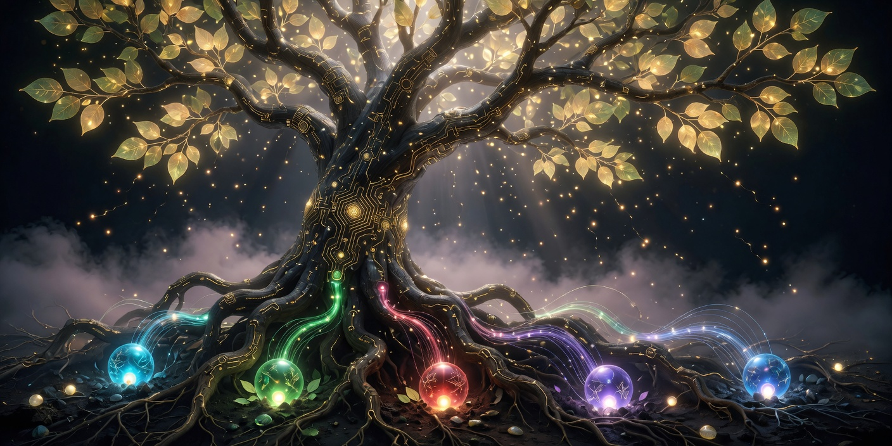
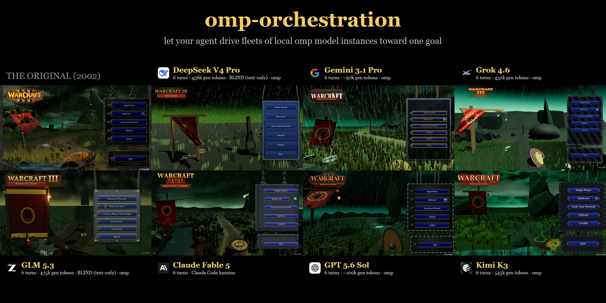

# omp-orchestration



A **Claude Code skill** that lets your agent drive local **omp (oh-my-pi)** instances toward a goal (tested against omp 17.3.5):

> *"Hey — use omp to spin up instances of DeepSeek, Kimi, and GLM, and have each one build me a game menu / a dashboard / a parser. Verify their work between turns and tell me who did it best."*

With this skill installed, your agent knows how to:

- **configure providers** in `~/.omp/agent/models.yml` (any OpenAI-compatible endpoint — OpenRouter, official vendor APIs, or your own local vLLM/llama.cpp server), with the schema traps pre-solved
- **decompose a goal into bounded turns** with mechanical acceptance criteria and a NOTES.md memory trail (each omp launch is a fresh context — the repo *is* the memory)
- **launch non-interactive turns** with the battle-tested incantation (`-p --approval-mode yolo --max-time … </dev/null` + an `EXIT $?` sentinel), and poll them properly
- **diagnose every failure mode we ever hit**: deadline-exceeded salvage, provider mid-generation death, *silent process kills* (detectable only via session-jsonl staleness), empty completions
- **verify independently** — never trusting the builder's self-report — and hand-patch only small mechanical slips, logged, with everything else going back to the builder as a focused relaunch
- **run many model lanes in parallel** without them trampling each other (git pathspec discipline, per-lane verification harnesses, spend gates that pause cleanly when credits run low)
- **account tokens and spend** per lane from omp's session logs and the providers' own billing endpoints

## Install

Copy the skill into your Claude Code skills directory:

```bash
git clone https://github.com/loktar00/omp-agent-skill
mkdir -p ~/.claude/skills/omp-orchestration
cp omp-agent-skill/SKILL.md ~/.claude/skills/omp-orchestration/
```

Then just ask your agent to use omp — the skill loads on demand.

## Engine adapters

The same orchestration doctrine drives more than omp. This repo now ships engine adapters —
**each written by the engine itself**, running headless under agent orchestration, empirically
verifying every flag against its own installed CLI before documenting it:

- **`SKILL.md`** (root) — omp (oh-my-pi), doctrine + mechanics (tested against omp 17.3.5)
- **`codex/SKILL.md`** — OpenAI Codex CLI (`codex exec`), written by Codex itself (codex-cli 0.147.0)
- **`grok/SKILL.md`** — xAI Grok CLI (`grok -p`), written by Grok itself (grok 1.0.5)

Each adapter's `NOTES.md` is its evidence trail: which facts were verified by running commands vs.
prior knowledge. Install any adapter the same way:

```bash
mkdir -p ~/.claude/skills/codex-orchestration && cp omp-agent-skill/codex/SKILL.md ~/.claude/skills/codex-orchestration/
mkdir -p ~/.claude/skills/grok-orchestration  && cp omp-agent-skill/grok/SKILL.md ~/.claude/skills/grok-orchestration/
```

The engine adapters are mechanics-only; the shared orchestration doctrine (turn design,
verification discipline, salvage, multi-lane rules) lives in the root SKILL.md — install it
alongside whichever engine you use.

## What's in here

- **`SKILL.md`** — the skill itself: the full operating guide, written *to the agent*
- **`templates/effort_proxy.py`** — a ~90-line streaming proxy that injects request parameters omp can't send itself (e.g. vLLM's `chat_template_kwargs.reasoning_effort`); point a provider's `baseUrl` at it
- **`assets/banner.jpg`** — the architecture (generated by Grok CLI's own /imagine, orchestrated headlessly — of course)
- **`assets/benchmark-grid.png`** — the proof-of-work: seven models' builds of the same brief next to the 2002 original

## Provenance



Everything in the skill was learned the hard way: ~90 real omp turns across **10 models and 5
providers** rebuilding the Warcraft III: Reign of Chaos menu as a real-time browser scene — the
banner shows seven of those builds next to the 2002 original, including two models that built it
**completely blind** (text-only, never saw a single image). No behavior in the guide is
paraphrased from docs; it was all observed, current as of the omp build of 2026-08-25.

## License

CC BY 4.0 — use it, adapt it, ship it, but **attribution is required**: credit "omp-agent-skill by Jason Brown (loktar00)" with a link back to this repo.
